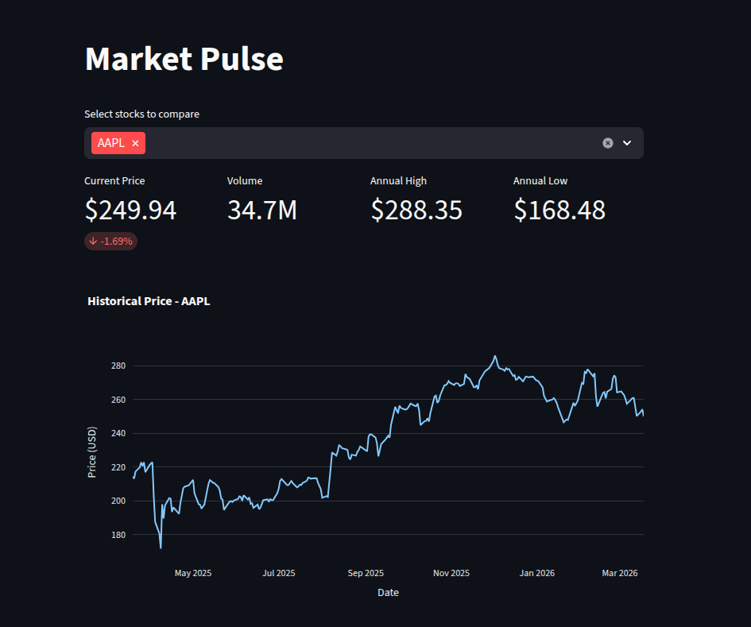
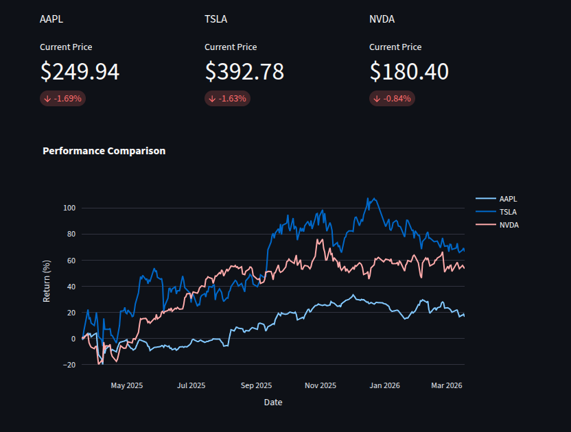
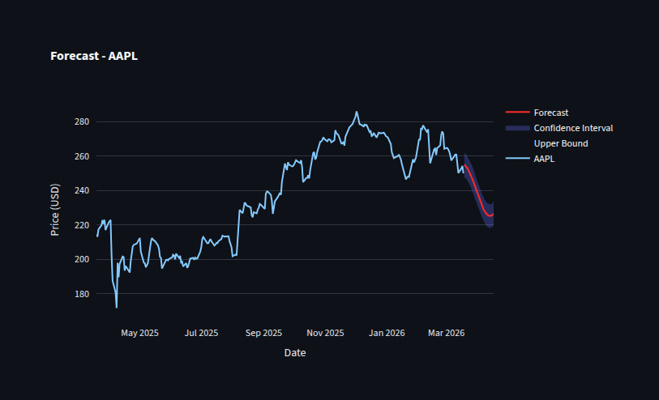

# 📈 Market Pulse

A real-time stock market dashboard built with Streamlit, featuring
interactive price charts, key financial metrics, and 30-day trend forecasting.

## Live Demo

<https://market--pulse.streamlit.app/>

## Features

- Track any stock in real time (AAPL, TSLA, NVDA, and more)
- Key metrics: current price, daily change, volume, 52-week high/low
- Interactive historical price chart powered by Plotly
- Multi-stock comparison with normalized returns
- 30-day trend forecast with confidence intervals using Prophet

## Screenshots

### Main Dashboard

  
Real-time stock tracking with current price, daily change, volume, and 52-week high/low metrics.

### Multi-Stock Comparison

  
Compare multiple stocks with normalized returns to identify relative performance trends.

### 30-Day Forecast

  
Predictive analytics powered by Prophet, showing trend direction with confidence intervals.

## Tech Stack

- Python
- Streamlit
- Plotly
- yfinance
- Prophet
- Pandas

## Installation

```bash
git clone https://github.com/hadron-lhc/market-pulse
cd market-pulse
pip install -r requirements.txt
streamlit run src/app.py
```

## Project Structure

```
market-pulse/
├── src/
│   ├── app.py        # Streamlit interface
│   └── utils.py      # Data fetching, metrics and chart logic
├── requirements.txt
└── README.md
```

## Disclaimer

Forecasts generated by Prophet are for educational purposes only
and do not constitute financial advice.
